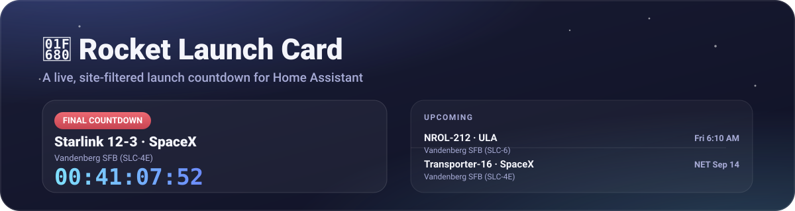

# Rocket Launch Card



> The banner above is an illustration of the card's layout, not a screenshot.

Modern Home Assistant Lovelace cards and automation blueprints, built to
answer one question fast: **is there a launch from my site coming up, and
how long until it goes?**

This is the frontend half of a two-repo project:

- **[Tmatz27/ha-rocket-launch-tracker](https://github.com/Tmatz27/ha-rocket-launch-tracker)**
  — a small custom integration that polls
  [Launch Library 2](https://ll.thespacedevs.com) (thespacedevs.com), filtered
  **server-side** to whatever launch site you configure, and exposes it as
  Home Assistant sensors. Install this first — the cards below read its
  entities.
- **This repo** — the two Lovelace cards and four automation blueprints
  that consume those sensors.

### Why two repos, and why not the other rocketlaunch.live integration

An earlier version of this project read
[djtimca/harocketlaunchlive](https://github.com/djtimca/harocketlaunchlive)
instead. That integration always exposes exactly the **next 5 launches
worldwide**, with no per-site filter of its own — if 5 launches from other
sites were queued up before the next one from yours, it simply wasn't in the
data yet, and no amount of client-side filtering could show it. It also
doesn't expose an explicit Go/Hold/Scrub status field, only raw target times.

`ha-rocket-launch-tracker` exists to fix both of those: filtering happens at
the data source (Launch Library 2 supports it directly), and each launch
carries a real status (Go, TBD, Hold, Success, Failure, In Flight) instead of
one inferred purely from timing.

## What's here

- **`rocket-launch-card`** — an upcoming-launches list for your tracked site,
  with a live ticking countdown for near-term launches and a compact line for
  everything farther out
- **`rocket-launch-countdown-card`** — a dedicated countdown that stays out
  of the way until the next launch is close, then takes over with a big live
  timer
- Four **automation blueprints** — a daily "launch today" alert, a
  countdown alert capped at a fallback time so an overnight launch still
  warns you before bed, a reschedule alert for weather delays or a launch
  moving earlier than expected, and a pet-safety alert to bring animals
  inside before an imminent, nearby launch

## Requirements

1. Home Assistant 2024.10 or newer
2. HACS
3. [Rocket Launch Tracker](https://github.com/Tmatz27/ha-rocket-launch-tracker)
   installed and set up for your site first

## Install with HACS

1. Open **HACS**
2. Open the three-dot menu and choose **Custom repositories**
3. Add `https://github.com/Tmatz27/ha-rocket-launch-card-`
4. Choose the **Dashboard** category
5. Install **Rocket Launch Card**
6. Refresh the browser

If the card doesn't show up under **Add card**, hard-refresh the dashboard
(`Ctrl+Shift+R` / `Cmd+Shift+R`) and check **Settings → Dashboards → ⋮ →
Resources** for a JavaScript module entry pointing at
`/hacsfiles/ha-rocket-launch-card-/rocket-launch-card.js`. YAML-mode
dashboards need that resource added by hand in `configuration.yaml`.

## Add the cards

Both cards need exactly one thing: the tracker integration's **Upcoming
Launches** sensor for your site (e.g. `sensor.vandenberg_upcoming_launches`
— check **Settings → Devices & Services → Rocket Launch Tracker** for the
exact entity id, or just use the visual editor's entity picker).

```yaml
type: custom:rocket-launch-card
entity: sensor.vandenberg_upcoming_launches
```

```yaml
type: custom:rocket-launch-countdown-card
entity: sensor.vandenberg_upcoming_launches
trigger_hours: 2
```

Both cards also have a visual editor — use **Add card → Rocket Launch Card**
/ **Rocket Launch Countdown Card** and everything below is editable there.

### `rocket-launch-card` options

| Option | Default | Description |
| --- | --- | --- |
| `title` | `Rocket Launches` | Card heading |
| `entity` | *(required)* | The tracker integration's "Upcoming Launches" sensor |
| `live_window_hours` | `24` | Launches inside this window get the big live countdown; farther out shows as a simple line |
| `show_description` | `true` | Show the mission description on the live countdown card |

### `rocket-launch-countdown-card` options

| Option | Default | Description |
| --- | --- | --- |
| `title` | `Launch Countdown` | Card heading |
| `entity` | *(required)* | Same sensor as the main card — the countdown tracks whichever launch is first in its list |
| `trigger_hours` | `2` | The countdown takes over this many hours before launch |
| `show_when_inactive` | `true` | When outside the window, show a one-line "next launch in..." summary instead of collapsing to nothing |

## How the live behavior works

- **Live countdown**: once the next launch has a known target time and is
  inside `live_window_hours` (main card) or `trigger_hours` (countdown
  card), the timer ticks every second, client-side, between the
  integration's own adaptive polling (as often as every few minutes once a
  launch is close — see the tracker repo's README for exactly how that's
  paced against Launch Library's rate limit).
- **Real status, not just timing**: a launch carries an actual status —
  Go, TBD, Hold, Success, Failure, In Flight — shown as the badge. A Hold or
  an In-Flight launch stays prominent regardless of the configured window.
- **Delayed launches**: each card remembers the first target time it saw for
  a given launch (by Launch Library's own launch id, in your browser's
  `localStorage`). If a later poll reports a later time for the same launch,
  a **"Slipped from ..."** badge appears until that launch is no longer
  tracked.
- **Past the predicted time with no status update yet**: for up to 15
  minutes, the card shows "in launch window" and counts up. Past that, it
  shows **"Awaiting updated status"** instead of a runaway or frozen timer.
- **No known time yet**: a launch with only a rough precision (e.g. "Month")
  and no exact date shows that as text — never a fake countdown.

## Automation blueprints

All four live in [`blueprints/automation/`](blueprints/automation) and read
the tracker's **Next Launch** sensor (a timestamp entity —
`sensor.<site>_next_launch`). Import with the buttons below (they open your
own Home Assistant), or **Settings → Automations & Scenes → Blueprints →
Import Blueprint** and paste the raw GitHub URL.

### Launch day alert

Checks once a day and sends one notification if a launch is scheduled for
today, naming it and its time.

[](https://my.home-assistant.io/redirect/blueprint_import/?blueprint_url=https%3A%2F%2Fraw.githubusercontent.com%2FTmatz27%2Fha-rocket-launch-card-%2Fmain%2Fblueprints%2Fautomation%2Frocket_launch_day_alert.yaml)

### Countdown alert

Fires once per launch, normally 1 hour before — but never later than a
fallback clock time (default 8:30 PM). A launch at 2 AM still gets a
heads-up at 8:30 PM the evening before instead of a 1-hour warning while
you're asleep; a launch at 6 PM still gets the normal 1-hour warning at 5 PM
since that's earlier than the fallback.

[](https://my.home-assistant.io/redirect/blueprint_import/?blueprint_url=https%3A%2F%2Fraw.githubusercontent.com%2FTmatz27%2Fha-rocket-launch-card-%2Fmain%2Fblueprints%2Fautomation%2Frocket_launch_countdown_alert.yaml)

This one needs a **one-time helper** so the minute-by-minute check doesn't
repeat itself: **Settings → Devices & Services → Helpers → + Create Helper →
Text**, name it anything (e.g. "Rocket Launch Alert Sent"), and pick it for
the blueprint's *Dedup helper* input.

### Reschedule alert

Fires whenever the next tracked launch's time changes by more than a
configurable amount (default 15 minutes) from what you were last told —
a weather hold pushing it back, or it moving up earlier than expected —
naming the old and new time. Event-driven (fires on the change itself, not
a fixed check interval), and stays silent when a different launch simply
becomes "next" after today's one flies — that's not a reschedule.

[](https://my.home-assistant.io/redirect/blueprint_import/?blueprint_url=https%3A%2F%2Fraw.githubusercontent.com%2FTmatz27%2Fha-rocket-launch-card-%2Fmain%2Fblueprints%2Fautomation%2Frocket_launch_reschedule_alert.yaml)

This also needs a **one-time helper** (same steps as above) — use a
**different** Text helper than the countdown alert's, since they track
different things.

### Pet safety alert

A short-notice nudge to bring pets inside before a nearby launch's acoustic
shock: fires a set number of minutes before launch (default 15), but only
if that moment falls between an "earliest morning" time and a bedtime
cutoff (defaults 6:00 AM–8:30 PM). Unlike the countdown alert, a launch
outside that window is **skipped entirely rather than shifted** — if
you're already asleep, the pets are already in for the night and there's
nothing to act on. Optionally personalize the message with your pets'
names.

[](https://my.home-assistant.io/redirect/blueprint_import/?blueprint_url=https%3A%2F%2Fraw.githubusercontent.com%2FTmatz27%2Fha-rocket-launch-card-%2Fmain%2Fblueprints%2Fautomation%2Frocket_launch_pet_safety_alert.yaml)

This also needs its own **one-time helper**, separate from the other two.

All four blueprints need a **notify action** name, e.g.
`notify.mobile_app_your_phone` — find the exact name under **Developer
Tools → Actions** by searching "notify". `notify.notify` broadcasts to every
notify target.

After importing, open the automation's **Traces** (or **Developer Tools →
Template**, pasting in the blueprint's template) to confirm it's reading
your launch data as expected before relying on it.

## Privacy

Both cards read only Home Assistant's local entity state — no outbound
requests, no telemetry, no third-party calls. Delay tracking is stored in
your browser's `localStorage`, scoped to your Home Assistant origin, and is
pruned automatically after 14 days of inactivity.

## Development

```bash
npm test
```

No build step. `rocket-launch-card.js` is the HACS release file.

## Credits

Data comes from [Launch Library 2](https://ll.thespacedevs.com)
(thespacedevs.com) via
[Tmatz27/ha-rocket-launch-tracker](https://github.com/Tmatz27/ha-rocket-launch-tracker).
Card structure and interaction patterns follow the same conventions as
[Tmatz27/ha-sab-deluge-card](https://github.com/Tmatz27/ha-sab-deluge-card).

## License

MIT
